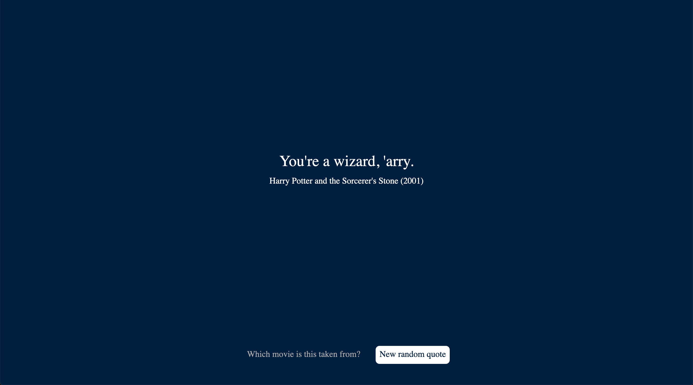

<h1 align="center">🎬 Quotatitous</h1>

<p align="center">
  <a href="https://github.com/prettier/prettier"></a>
  <a href="https://circleci.com/gh/litil/quotatious/tree/master"></a>
  <a href="https://vercel.com/guillaumeplambert/quotatious/deployments"></a>
  <a href="mailto:guillaume.p.lambert@gmail.com"></a>
  <a href="https://twitter.com/shipasap"></a>
</p>

<p align="center">
  🍿 <i>A minimalist app testing your cinema culture</i> 🍿
  <br>
  <small>Built with Next.js. Deployed & hosted with Vercel.</small>
  <br>
  <a href="https://quotatious.now.sh/"><b>https://quotatious.now.sh/</b></a>
</p>

<p align="middle" style="margin-bottom:40px; margin-top:32px; width:100%;">
  
</p>

## 🤷‍♂️ Where does the idea come from?

Believe me or not, it took me 10 years do build this single page application... I tried to combine so many features but it never properly worked or it didn't make much sense. So I went back to the original idea: displaying random quotes with 2 bug buttons to display the answer and move to the next quote.

## 📚 How to contribute?

I haven't written any _How to contribute_ guidelines but if you're interested in improving this project, just shout me a message! There are so many features and improvements to implement. Here are a few that I have in mind:

- [ ] display 4 potential answers for a quote and let the user pick one
- [ ] compute a score based on the user's answers
- [ ] better track how many sessions have been done
- [ ] add more quotes to the database. This will never end!

## 👨‍💻 Stack

This project is powered by **[NextJS](https://nextjs.org/)** and nothing else.

The **database is a simple JSON file** as there are, for now, only about 100 quotes. If I decide to add thousands more quotes or add the possibility to add a quote from a UI interface, I'll think about adding a real database.

The continuous integration job is done by **[CircleCI](https://circleci.com/gh/litil/quotatious/tree/master)**.

The site is hosted on **[Vercel](https://vercel.com/guillaumeplambert/quotatious/deployments)**. No specific configuration required.

## ⌨️ Scripts

### Run it locally

To run it locally, simply run:

```
npm run dev
```

You can test the application on http://localhost:3000

### Deploy a preview version

To deploy a preview version, run:

```
now
```

It will deploy the application on [https://quotatious.guillaumeplambert.now.sh](https://quotatious.guillaumeplambert.now.sh).

### Deploy on production

To deploy the application on production, run:

```
now --prod
```

The application is now deployed on [https://quotatious.now.sh](https://quotatious.now.sh). Next will provide you with a direct link to inspect the application and its deployment.
